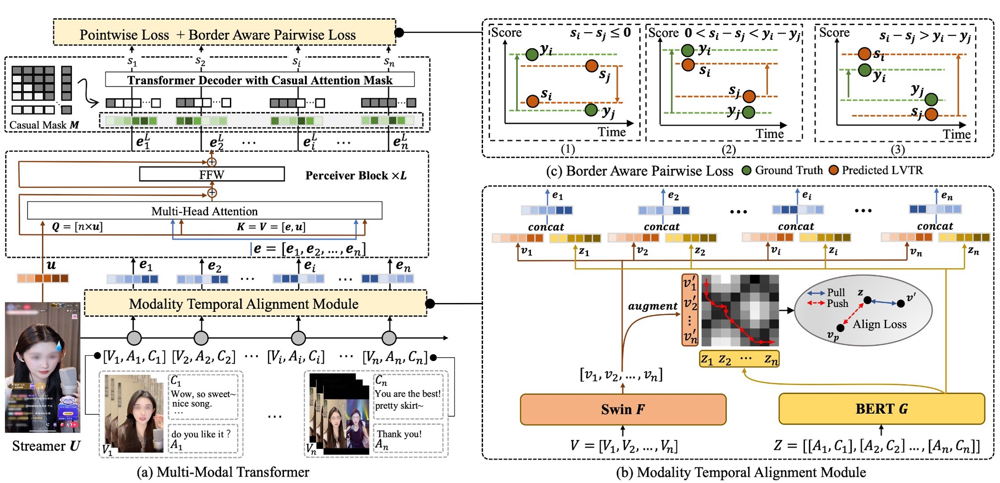

# A Multimodal Transformer for Live Streaming Highlight Prediction

This project presents a novel approach to live streaming highlight prediction using a multimodal transformer framework. Our model effectively integrates visual, audio, and textual modalities to predict highlight moments in live streaming content. The proposed architecture includes a **Modality Temporal Alignment Module** to address the temporal misalignment between different modalities and a **Border-aware Pairwise Loss** to enhance the model's performance by leveraging contrastive information.


We conducted extensive experiments on our newly constructed **KLive** dataset, which contains a large-scale collection of live streaming data, demonstrating that our model outperforms existing baselines in both real-world scenarios and public datasets. The results indicate that our approach significantly improves the accuracy of highlight detection in live streaming environments.

We are excited to announce the release of the **KLive** dataset, which can be accessed [here](src/dataset/README.md).

## Citation
If you find our work useful, please cite it as follows:

```
@INPROCEEDINGS{10687664,
  author={Deng, Jiaxin and Wang, Shiyao and Shen, Dong and Zhao, Liqin and Yang, Fan and Zhou, Guorui and Meng, Gaofeng},
  booktitle={2024 IEEE International Conference on Multimedia and Expo (ICME)}, 
  title={A Multimodal Transformer for Live Streaming Highlight Prediction}, 
  year={2024},
  volume={},
  number={},
  pages={1-6},
  keywords={Visualization;Codes;Fuses;Annotations;Streaming media;Predictive models;Transformers;Multimodal Transformer;Modality Temporal Alignment;Border-aware Pairwise Loss;Live Streaming Highlight Prediction},
  doi={10.1109/ICME57554.2024.10687664}}
```